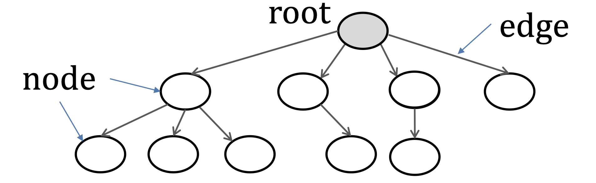

# Tree
Non-linear data structure: Tree and Graph.

Formal Definition:
: an important aproach to organize data.

Basic Properties of tree: 
: 


### Example
Given a sorted collection of data. (A data dictionary)

**Operator**:
- search
- insert

Using array: search $O(\log{n})$, insert $O(n)$
Using linked list: search $O(n)$, insert $O(n)$
Using tree: search $O(\log n)$, insert $O(\log n)$

### What is a tree?




A tree consist of:
- A set of nodes, each node contains:
    - key field
    - multiple data items
- A set of edges, each edge connects a pair of nodes
- The top node is the root

The node at the bottom are the leaves.

### First property: 
Each node (except the root) have and only have one parent.

If we say $u$ is the parent of $v$ and $w$, we can also say that $v$ and $w$ are the child of $u$. $v$ and $w$ are siblings.

We say $u$ is an ancestor of $v$ if one of the following follows:
1. $ u = v$
2. $u$ is a parent of $v$
3. $u$ is a parent of an ancestor of $v$

Thus $v$ is the descendent of v.
Proper ancestor and proper descendent is an ancestor and descendent that $ u \not = v$

**RECURSION**

Node types in a tree:
- leaf nodes: nodes without child
- internal nodes: have at least 1 child.

### Second Property: 
Each node in the tree is the root of a smaller tree.
 (A recursive definition, tree is a recusive data structure)

Path:
: The edges from node $u$ to node $v$.
We do not repeatedly visit a node in the path.
There is one and only one path from root to each node.

Depth:
: The number of edges from the root to the node $u$.

Level:
: All the nodes with the same depth.

Height:
: The maximum depth of all its nodes.

Radius: the longest path distance between two nodes.

### Third Property:
A k-ary tree means every internal node has at most k child nodes.
A binary tree is a tree that each node has at most 2 child nodes.

A binary tree is either:
1. empty
2. a node has:
    1. one or more pieces of data
    2. a left subtree, which is itself a binary tree.
    3. a right subtree, which is itself a binary tree.

There is an order for the nodes in the same level.

Full level of a binary tree:
: the level $l$ is full if it has $2^l$ nodes.

A full binary tree has $2^{h+1} - 1$ nodes. (each level of the binary tree is full)

A binary tree with height h is complete if (a complete binary tree):
1. level $0,...,h - 1$ are full levels.
2. at level h, the leaf nodes are "as far left as possible". Which means if you want to add a new node, you can only add it to the right of the existing node. It should not be at the left at any existing node (even if they have different parents etc.).

### Implementation of Binary Tree
```Java
class binTreeNode{
    binTreeNode left;
    binTreeNode right;
    int key;
}
```

### Traversing a Binary Tree
1. Level traversal
2. left - root - right (inorder)
3. root - left - right (pre order)
4. left - right - root (post order)

Can be achieved with recursive or iterative techniques.