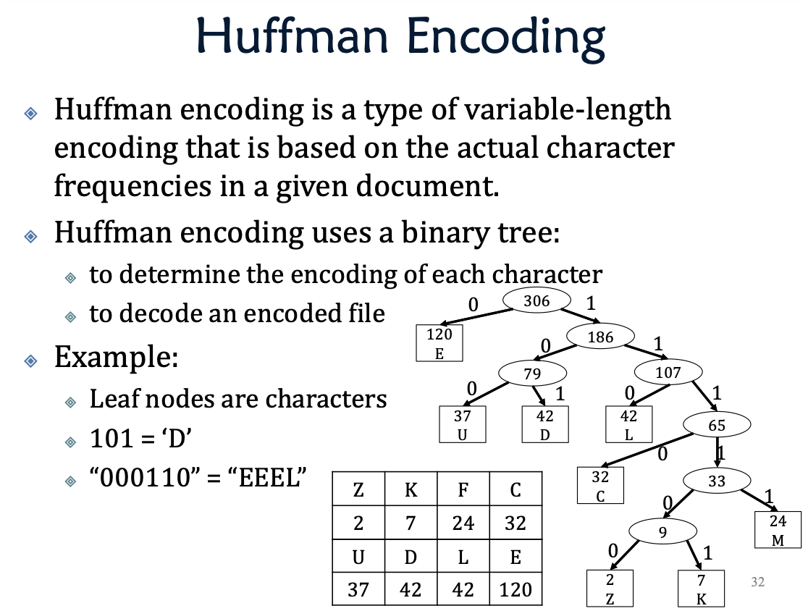
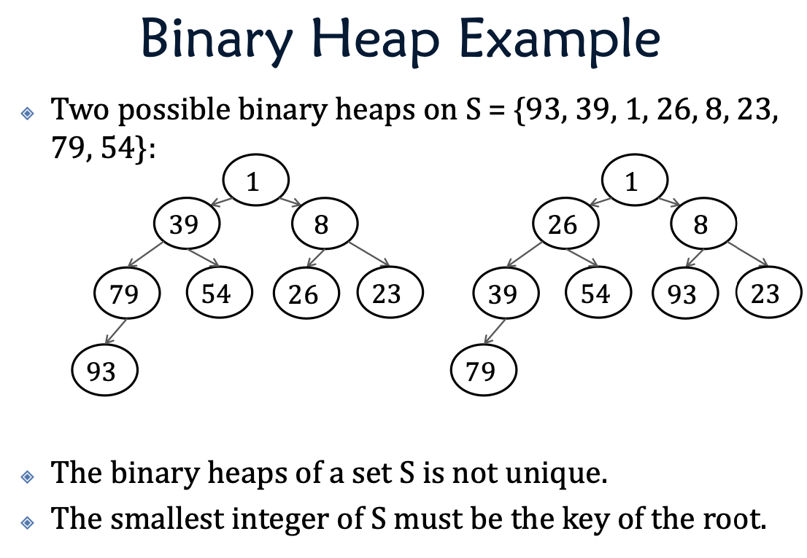
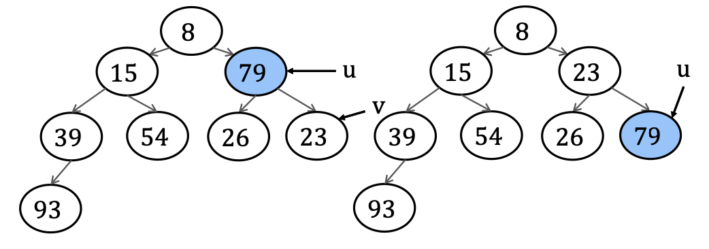
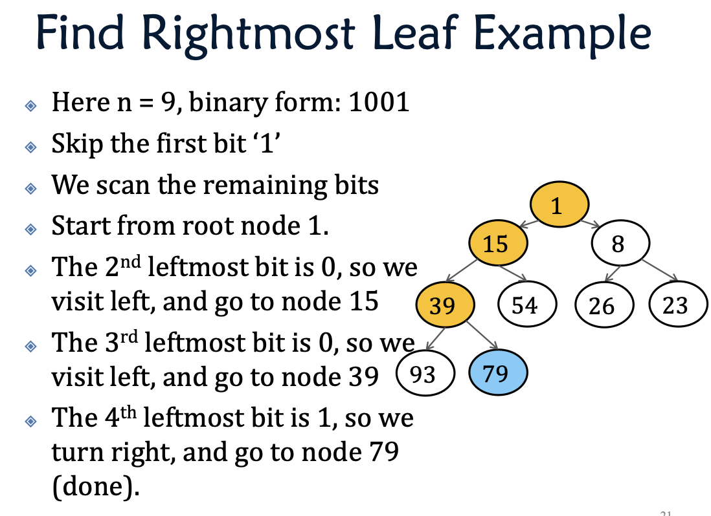

# More About Binary Tree

### Application in Calculators
e.g. ((a + (b * c)) - (d/e))
1. Inorder: left, root, right
2. Preorder: root, left, right
3. Postorder: left, right, root

### Character Encoding
Mapping each character to a number.

Although fixed length encoding is very simple, but it is also very space consuming.

To save space, we invented the variable length encoding. By asigning different shorter length values to frequently accuring characters.

e.g. if we have aaaaabbc, we would like to assign a to 0, b to 1 and c to 10. Since a is the most frequent.

However, we have a small challenge. When we are decoding an encoded document, we don't know the boundaries between characters.

| Character | code |
| :---|---:|
| e|  01|
| s| 111|
| o| 100|
| t|  00|

The encoding of one character should not be a prefix of another character.

Thus we encode it by **Huffman Encoding**. It can determine the encoding of each character by their frequency, and decode the encoded tree.



How to build a Huffman Tree:
1. Create a liste of nodes that contains the character and frequency.
2. Remove and "merge" the nodes wit the two smallest frequences and form a new node in the list that is their parent.
3. Add the parent into the list.
4. Repeat step 2 and 3 until there is only one node left in the list.

Huffman coding is the optimal solution of space for variable length encoding to a document.

## Advanced Binary Tree

### Priority queue
Normal queue: FIFO
Priority queue: Out priority doesn't depend on in.

Operators:
- Insert(e)
- Delete-min()

Applications:
AI (the A* algorithm)
OS 
Graph Search (finding shortest path in graph)

With Delete-min() it is a sorting algorithm, which is heap sort.

Implementations:
1. $O(n)$ Space consumption
2. $O(\log n)$ insertion time
3. $O(\log n)$ deletion time

Binary heap on $S$ is a binary tree $T$, which satisfies: 
1. $T$ is a complete binary tree.
2. Every node $u$ in $T$ corresponds to a distinct value in $S$.
3. If $u$ is an internal node in $T$, the key of $u$ is smaller than all the child nodes.

**Storage**:



We can see that the binary heap for a set of numbers $S$ is not unique. But the root is always the smallest. We can also see that the storage is $O(n)$

**Insertion**:

Because we need to ensure it's still a complete binary tree, we can only insert the new node at the left-most place at level $h$.

Then we compare the new node with it's parent. If it's smaller than it's parent, we swap. Until the new node's parent is smaller than the new node, or the new node reaches the root.

```Java
Insertion(Node newNode){
1.    newNode with key e;
2.    add newNode to the rightMost available position of the tree;
3.    if (tmpNode = root) return;
4.    if (tmpNode.key > parent.key){
          return;
      }else{
5.        swap keys of tmpNode, parent;
          set tmpNode = parent;
          repeat from step3.
      }
  }
```

**Delete-Min**

Because after deletion, it is still a complete binary tree, we can only delete the node at the right-most position. Thus we swap the key of right-most node and the root. Then we reorder the tree, by exchanging the root with child that are smaller than them.



```Java
DeleteMin(){
1.    Find root and rightMost node;
      swap keys of root and rightMost;
2.    set u <- root;
3.    if u is leaf return;
4.    if key of u < key of children, return
5.    else swap child and u, repeat from step 3;
}
```
Time complexity: $O(\log n)$

**Finding Right-Most Node**

If we have $n$ nodes, we turn $n$ into binary format. We abandon the first character, for the rest, if we meet 0, we go left, if we meet 1, we go right. We will then reach the right-most node.

