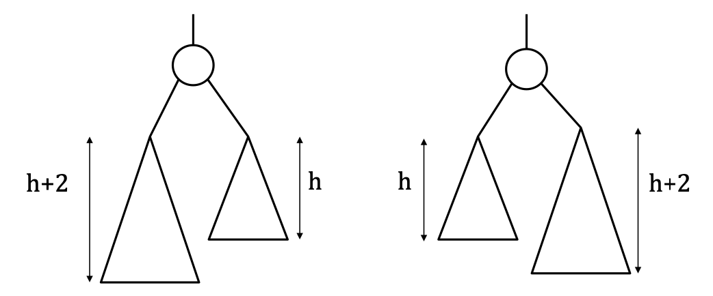
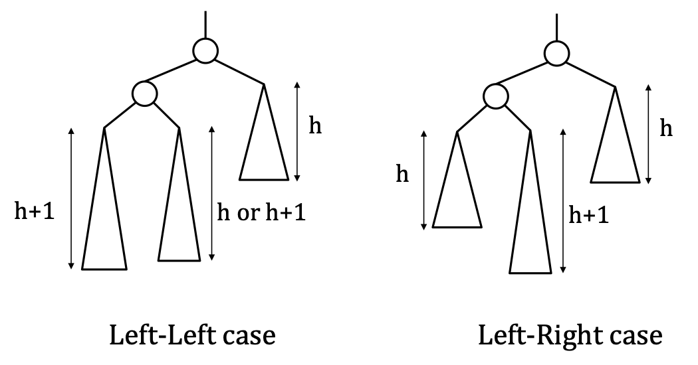
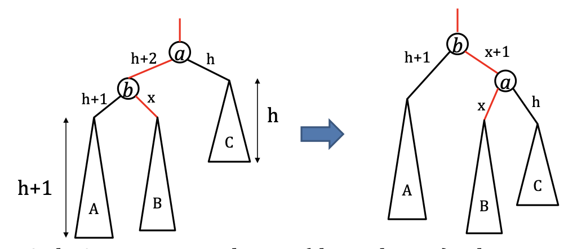
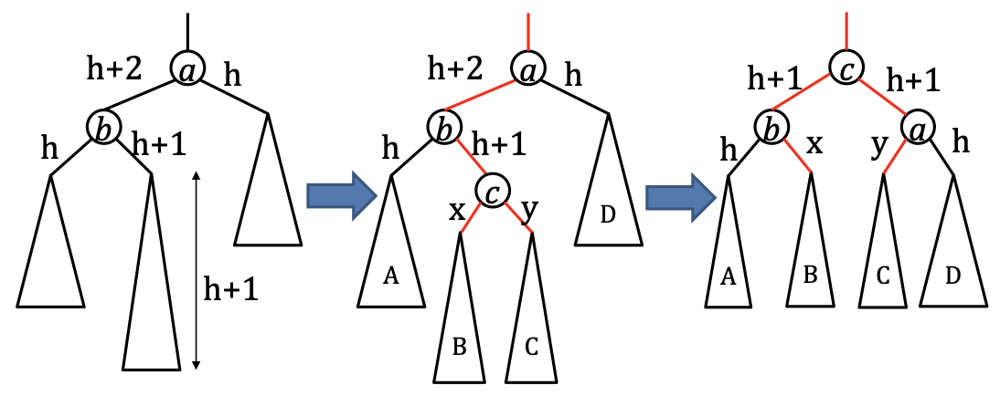

# More About Binary Heaps

### Heap sort
**Build a heap**: insert each value in $S$ into a binary heap $T$. Time complexity: $O(n \log n)$

**Delete the Min node in T**: call `deleteMin()` method $n$ times. Time complexity: $O(n \log n)$

### Implementing Binary Heap
#### Dynamic Array
We need to initialize the size of the array when we create it.
With dynamic array, we can add unlimited numbers of objects into the array.

A **pointerless** method of a binary heap. With space complexity $O(n)$ and build heap time complexity $O(n)$.

#### Storing Binary Heap in an Array
We **linearize** the tree into an array.

Storing the binary heap with level traversal, and storing the result into an array.

Lemma: 
: If there is a node $u$ in $T$ with $A[i]$
$u$'s left child is $A[2i]$
$u$'s right child is $A[2i + 1]$

Hints for proving this lemma: 
The tree is a complete binary tree.
We find the right-most node with transfering $n$ to binary form.

Lemma:
: If there is a node $u$ in $T$ with $A[i]$
$u$'s parent node is $A[\lfloor\frac{u}{2}\rfloor]$

Lemma: 
: The right most leaf node of T is A[n].

#### Root-fix Operator
Suppose we have a complete binary tree $T$ with root $r$
1. The left subtree of $r$ is a binary heap.
2. The right subtree of $r$ is a binary heap.
3. The key of $r$ may not be smaller than the key of its child node.

**Root-fix Operator**:
: If the left and right subtree are binary heap, we only need to correct the root.

**Building a binary heap**
for each i = n down to 1:
perform root-fix on the subtree of T rooted at A[i].

**Time Complexity**
Suppose we have a full binary tree.

number of nodes * number of swaps (for each level)

So if $\sum_{i=0}^{h}2^i(h-i) = z$
then $z = 2z - z=2^h - 1 = n$
So the time complexity is $O(n)$


### The Binary Search Tree (BST)

The most powerful data structure in computer science.

Predecessor search:
: $q$,$S$: find the largest integer in $S$ that does not exceed $q$.

If we have a BST with tree height $h$ and number of nodes $n$.
We would like to have:
- $O(n)$ space consumption
- $O(h)$ predecessor search
- $O(h)$ deletion
- $O(h)$ insertion

A BST on a set $S$ of $n$ integers is a binary tree $T$ which satisfies:
1. $T$ has $n$ nodes (not a complete binary tree)
2. Each node $u$ in $T$ stores a distinct integer in $S$, which is called the key of $u$
3. Every internal node $u$, it holds that 
    1. The key of $u$ is larger than all the keys in the left subtree of u.
    2. The key of $u$ is smaller than all the keys in the right subtree of u.

Worst case of the BST is a linked list.

#### **Predecessor query**

Look at the root, if key of root > $q$, look at left subtree.

If key of root $\geq$ $q$, set answer to the key, and look at right subtree.

This method is right because the binary tree maintain the relationship between the key of nodes.
```Java
set p = -1;
set u = T.root;

findPredecessor(int q, Node u){
    if(u == null){ 
        return p;
    }
    if(u.key == q){
        p = u.key;
        return p;
    }
    if(u.key > q){
        u = u.left;
        findPredecessor(q,u);
    }else{
        p = u.key;
        u = u.right;
        findPredecessor(q,u);
    }
}
```

#### **Insertion**

```Java
set u = T.root;

Insert(e,u){
    if(e < u.key){
        if(u.left == null){
            new Node(e) = u.left;
            return;
        }else{
            u = u.left;
            Insert(e,u);
        }
    }else{
        if(u.right == null){
            new Node(e) = u.right;
            return;
        }else{
            u = u.right;
            Insert(e,u);
        }
    }
}
```
Time commplexity: $O(h)$

#### **Deletion**
If we want to delete node $u$.

***Case1***: $u$ is a leaf node, simply remove it from $T$.

***Case2***: 
If $u$ has right subtree
Find node $v$ storing successor $s$ of $e$.
Set key of $u$ to $s$.
*Case2.1*: 
if $v$ is a leaf node, swap $u$,$v$ keys, remove $v$.
*Case2.2*
otherwise, it must hold that $v$ has a right child $w$, but not left child. Replace node $v$ by subtree which is rooted at $w$.

***Case3***
if $u$ has no right subtree, it has a left subtree with node $v$. Replace $u$ by the subtree rooted at $v$

Time Complexity: $O(h)$

#### **Changing the Height of Tree to $\log n$**
A **balanced binary search tree** (BBST).

Balance:
: A binary tree $T$ is balanced if for  every internal node $u$ of $T$ the height of the left subtree of u differs from the height of the right subtree of $u$ by at most 1.

Theorem:
: A balanced binary tree with $n$ nodes has height $O(\log n)$.

**The AVL Tree**
: Stores the left subtree height and right subtree height in the nodes.

**The Black and White Tree**
: Colouring the nodes, and ensure the colour of black and white tree.

**Splay Tree**
: A different method.

A balanced tree is only imbalanced with height 2.

**Remedy the balanced tree**: We operate the 2-level imbalanced BST to make it balanced.

2 cases of 2-level-imbalance:




Repairing Left-Left case.

$x=h $ or $ h+1$
Changes: $b$'s parent, $a$'s parent, $B$'s parent.

Repairing Left-Right case.

$x = h$ or $h - 1$
$y = h$ or $h - 1$
$x \neq y \neq h-1$
Changes: $B$'s, $c$'s, $C$'s, $b$'s, $a$'s parent.

So we need the **remedy** step in **BST's insertion**. $O(\log n)$

Also **remedy** plus **deletion**. $O(\log n)$