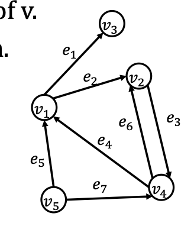
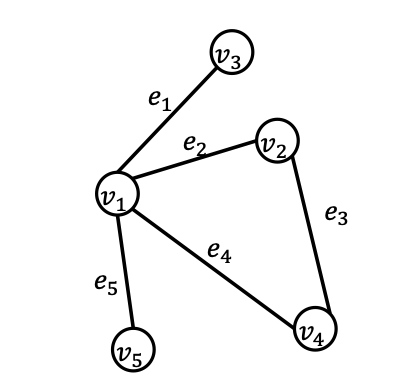
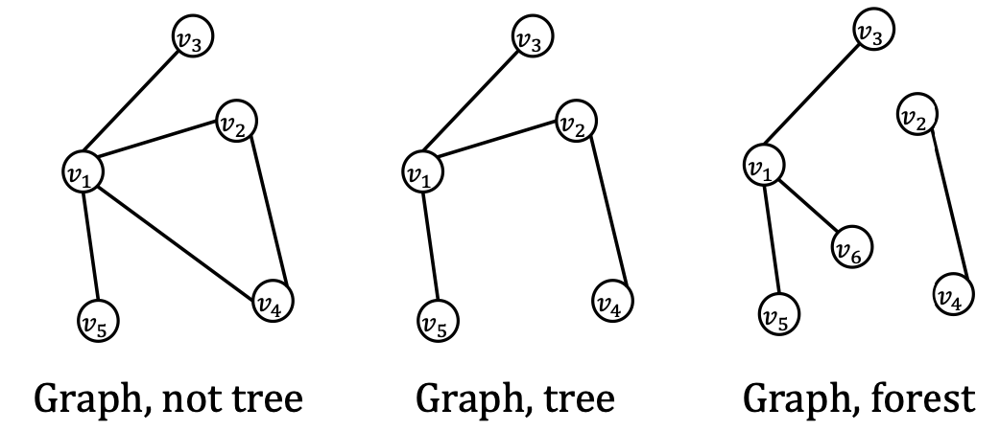
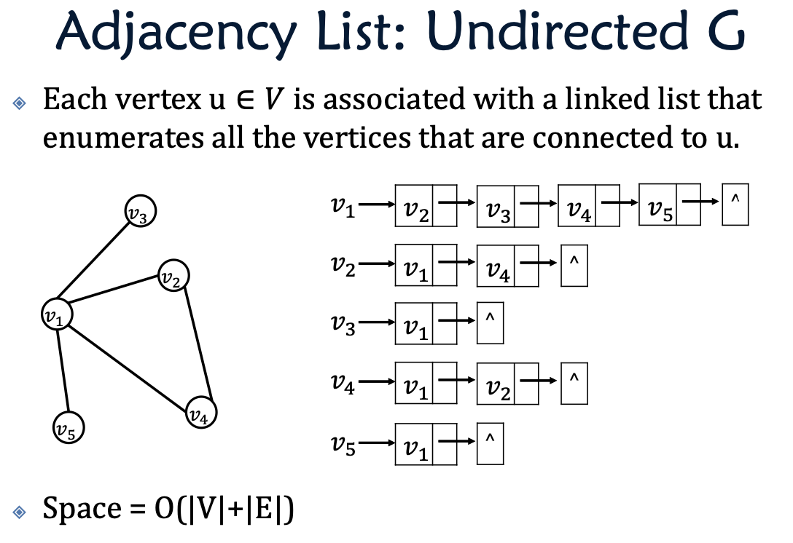
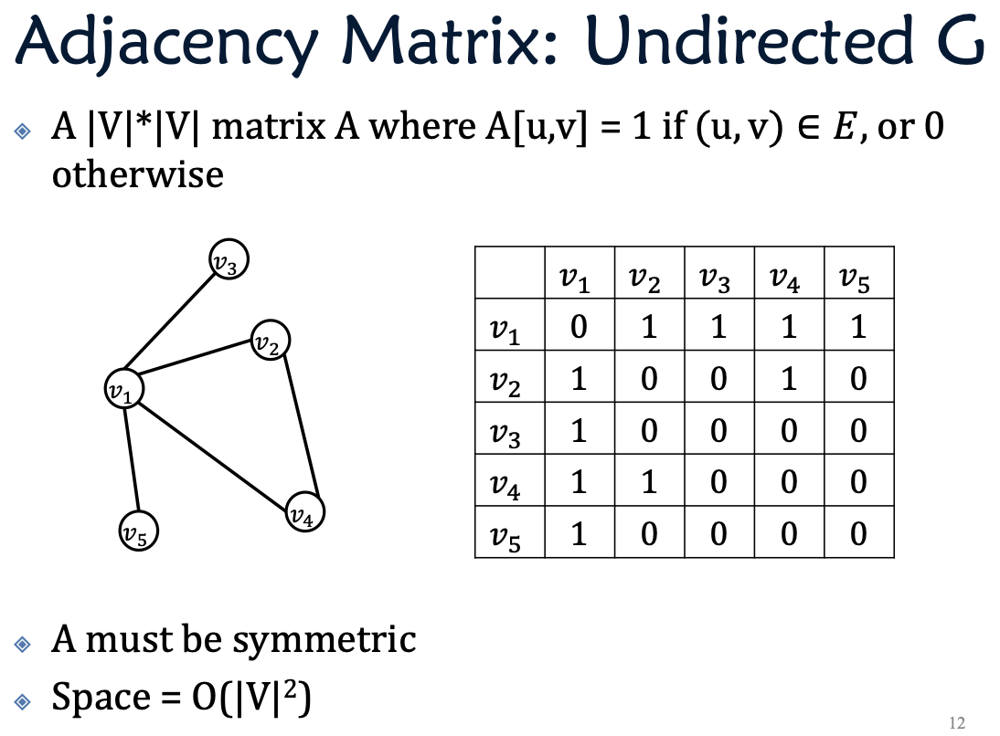

# Graph
Edge + vertices

## Graph Consepts

Directed:
: with direction
$G=(V,E)$
$V$ is a set of elements which we call as nodes.
$E$ is a set of unordered pairs $(u,v) (u,v \in V)$ there is a directed edge from $ u$ to $v$ elements which we call as edges.
(undirected graph with arrows)

Undirected:
: without direction
$G=(V,E)$
$V$ is a set of elements which we call as nodes.
$E$ is a set of elements which we call as edges.

Path:
: A path in G is a sequence of nodes, such that for ever $i \in [1, k-1]$, there is an edge between $v_i$ and $v_{i+1}$.

Cycle:
: for path $\{v_1, v_2, ..., v_k\}$ and $v_1 = v_k$.
remember to ask if there is a self-cycle.

Degree:
: For an undirected graph, the degree of node $u$ is the number of edges at $u$.
For a directed graph, the out-degree of node $u$, and the in-degree of node $u$. The degree of $u$ = outdegree + indegree.

Connected graph:
: for any two distinct nodes $u$ and $v$, $G$ has a path from $u$ to $v$.

## Storing the Graph
### Adjacency List

### Adjacency Matrix
