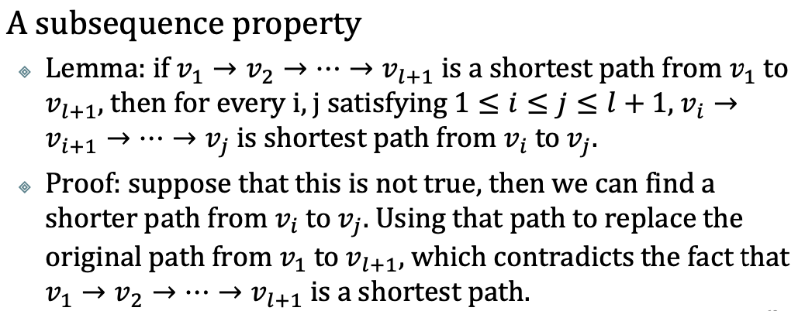
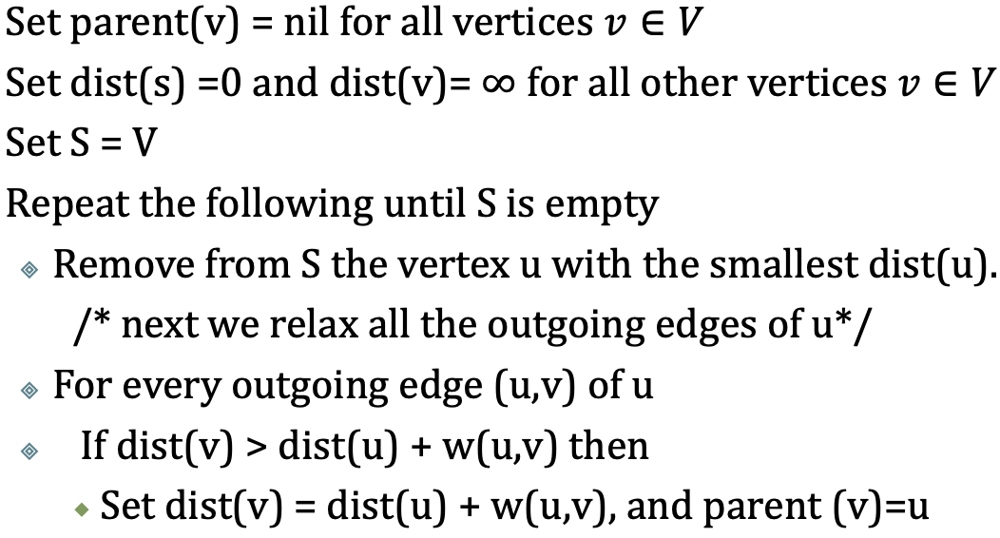

# Topological Sort

An order of the vertices in $v$ such that for any edge $(u,v)$, it must hold that $u$ preceeds $v$ in the order. The graph must be a DAG.

1. Create an empty list $L$.
2. Run a DFS on $G$, whenever you pop a node, append it to $L$.
3. Output the reverse order of $L$.

# Shortest Path with Weight

