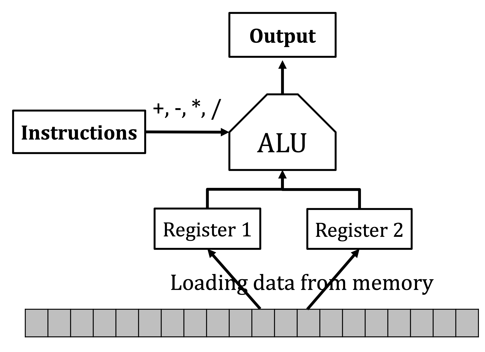

# Recursive Techniques

iteration:
: for-loop
    while-loop
    do-while-loop

***recursion:*** (to print all the numbers between n1 and n2)
```Java
printService(n1, n2){
    if(n1 == n2){
        print n2;
    }else{
        print n1
        printService(n1 + 1, n2)
    }
}
```

In this case, iteration is better than recursion (recursion will cause stack overflow).


### Recursive Problem Template

Solve a problem by reducing it to a simpler version of the same kind.
e.g. printService(1,3) -> printService(2,3) -> printService(3,3)

Base case:
: The simplest case, the reursion stops in some condition.

Recursive case:
: The cases that need to call recursion, to reduce the overall problem to one or more simpler problem of the same kind.

```Java
method(parameters){
    if(stopping condition){
        //handle the base case
    }else{
        //recursive case
        //probably need to do something here
        methodmodified parameter);
        //and probably need to do something here
    }
}
```

Ask yourself three questions when you are writing recursion:
* Can I break the question into simpler problems?
* What are the base cases?
* Do I need to combine the solutions of the subproblems to get the solution of the original problem?

# Algorithm Analysis

## RAM Computational Model
RAM:
: Random access memory. 
    Can be seen as cells storing data.

CPU <-(CPU Cost) RAM <-(I/O Cost) HardDisk
I/O cost is much larger than CPU cost.
CPU cost is what we care about when we are performing algorithm analysis.

finite cells, stores information and the address, store information immediatly(don't store things when turned off)

CPU:
: The Center Processing Unit
    * Initialization (giving values to variables)
    * Arithmetic (+,-,*,/,...)
    * Comparison/Branching (<=,=,>=)
    * Memory Access (Loading information to the register)
    * Random(x,y) (return a random value from [x,y](Add in week4))

## Algorithm Analysis
Algorithm:
: a sequence of basic operations

Cost Analysis:
: Two types of complexity to analyse the cost of an algorithm.
    * time complexity analysis: the length of the sequence of basic operations.
    * space complexity analysis: memory needed for your algorithm.

Correctness Analysis:
: See if your algorithm can really solve the problem.
    1. Prove your algorithm (prove correctness through math).
    2. Gaurantee your inplementation (bug free after coding)


#### An example of analysis
e.g. solve `1 + 2 + 3 + ... + n`

**The First Algorithm**
algorithm:
```
init a<-1 b<-n c<-0
repeat the following until a>b
    c <- a + c
    a <- a + 1
```

pseudocode:
```
1.load n from memory to b;
2.register a <- 1, c <- 0;
3.repeat 
4.    c <- c + a;
5.    a <- a + 1; 
6.until a > b;
7.return c;
```

Length of algorithm:
> 1.Step 1 1 memory access
2.Step 2 2 Initialization
3.Step 3 - 6 n(iteration) * 3 (two addition and one comparison) 

total length: 3n + 3

**The Second Algorithm**
Algorithm:
```
1. Load memory from memory to b;
2. a <- 1
3. a <- a + b
4. a <- a * b
5. a <- a/2
6. return A
```
total length: 5

### Worst case analysis
Worst cases:
: with the worst case, we can obtain the largest running time.

Worst Case Running Time:
: The worst-case running time (or worst case cost) of an algorithm under a problem size n, is defined to be the largest running time of the algorithm on all the inputs of the same size n.

In CS, it is an art to design algorithms with performance guarantee.

#### Example
e.g. An sorted array A(ascending), is $t \in A$?

> when the array is sorted, always think of binary search algorithm

**First Algorithm**
```
1. variable i <- 0;     1
2. repeat
3.  if(A[i] == t){      1+1(read and compare) * n
4.    return TRUE;      
    }
5. i <- i + 1;          1
6. until i > n;         1
7. return false
```
Worst case running time: $f(n) = 4n + 1$

**Binary Search Algorithm**(with a bug)

```
1. left <- 1, right <- n;             2
2. repeat
3.      mid <- (left + right)/2;      3
4.      if(t = A[mid]){               2
5.         return true;
6.      }else if(t < A[mid]){         1
7.           right <- mid - 1         2
        }else{
8.           left <- mid + 1;         2
        }
9. until left > right                 1
10. ruturn false
```
iteration: n -> n/2 -> n/2/2 -> ... -> 1 (log2 n cycles)

Worst case running time:$g(n) = 2+9*(1+log_{2} n)$