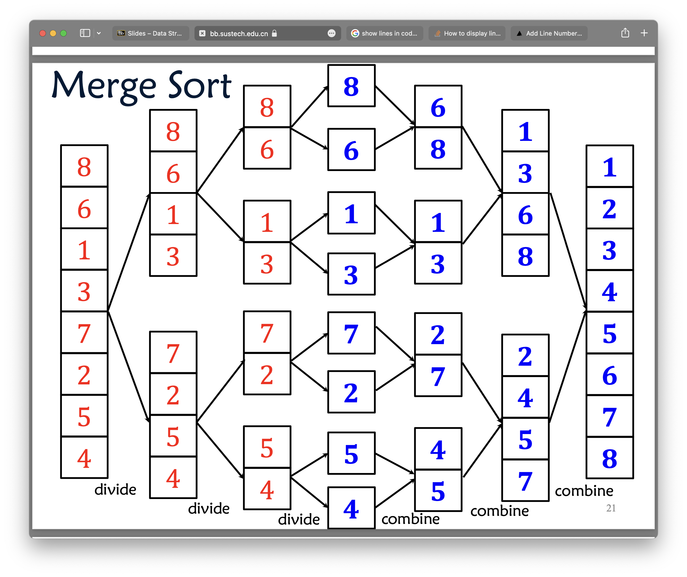

# Sorting Algorithm

### Merge Sort (with Divide-and-Conquer)

An example: sort 8,6,1,3,7,2,5,4

#### Divide and Conquer

Divide:
: divide the problem into smaller smaller problems
    e.g. sorting the smaller array 8,6,1,3

Conquer:
: solve each subproblem recursively

Combine:
: combine the solutions of all the subproblems and combine it into the solution of the original problem. 

If the array can be devided into smaller arrays, we can perform divide and conquer. If we divide the array into n/b length arrays, the number of subproblems are not greater than b (not always equal to b, like in binary search).

#### Merge Sort

pseudo code:
```Java
mergeSort(A,n){
    if(n>1){
        int p = Math.floor(n/2);
        B[1...p] = A[1...p];
        C[1...n-p] = A[p+1...n]
        mergeSort(B,p);
        mergeSort(C,n-p);
        A[1...n] = merge(B,C,p,n-p);
    }
}
```
Time Complexity: $ T(n) = 2T(\frac{n}{2}) + O(n) $ (A reccurence equation)



```Java
merge(L,R,nleft,nright){
    n = nleft + nright;
    A[n] new array;
    int i = 0, j = 0;
    for(int k = 1; k <= n; k++){
        if(i < nleft && (j > nright || L[i] <= R[j])){
            A[k] = L[i];
            i++;
        }else{
            A[k] = R[j];
            j++;
        }
    }
    return A;
}
```
Time Complexity of merge: $ O(n) $

**Solving the reccurence equation**

Substitution
: Mathematical inductions. Prove $T(n) = O(n log n)$ at n = 1, k and k + 1.

Recursion Tree Method
: replace the unknown $T(\frac {n}{2})$ with $2T(\frac {n}{4}) + O(n)$.

Master Method (Theorem)
: look up the table.
General form $T(n) = aT(n/b) + f(n)$ (a=number of subproblems b=how many parts you divide f(n)=the time requires to merge the subproblems)

**Solving with Master Theorem**
There is simple math theorem behind this.
$T(n) = \alpha T(\lceil\frac{n}{\beta}\rceil) + O(n^{\gamma}), \alpha \ge 1, \beta \ge 1, \gamma \ge 0, n \ge 2$
1. if $\log_{\beta}{\alpha} < \gamma$, then $T(n) = O(n^{\gamma})$
2. if $\log_{\beta}{\alpha} = \gamma$, then $T(n) = O(n^{\gamma} \log{n})$
3. if $\log_{\beta}{\alpha} > \gamma$, then $T(n) = O(n^{\log_{\beta}{\alpha}})$

In merge sort, $\beta = 2, \alpha = 2, \gamma = 1$ so it fits case 2, thus the time complexity of merge sort is $O(n\log{n})$.

### Quick Sort

Randomized vs. Deterministic

Deterministic: Go throught every elemen in an array.

Randomized: 
: Example: Find a 0 in an array.
Randomize a value as index, see if `A[index] = 0`. In the worst case, randomized algorithms is not better than deterministic algorithms. But in practise, they are always better.
They are often simple and sometimes can be proved to be faster.

```Java
quickSort(A,left,right){
    if(left == right){
        break;
    }
    int p = Random(left,right+1);
    partition(A,A[p]);
    quickSort(A_l, L_l, L_r);
    quickSort(A_r, R_l, R_r);
}

//put numbers larger than pivot to the right,
//smaller than pivot to the left
partition(A,pivot,L,R){
    int j = 0, k = 0;
    for(int i = L, i <= R; i++){
        if(A[i] < pivot){
            A_L[j] = A[i], j++;
        }else{
            A_R[k] = A[i], k++;
        }
    }
}
```

Time Complexity?
Worst Case: $O(n^2)$ if the random is not so good, your quick sort will become bubble sort.
But usually: $O(n\log{n})$ in expected running time.

Proof: $E[T(n)] = O(n \log{n})$
: Number of comparison = $X$, number of swapping = $X$.
The number of total operations = comparison + swapping ($O(X)$)
So we prove $E[X] = O(n \log{n})$
Suppose $e_i$ is the i-th smallest number A, $e_j$ is the j-th smallest number in A
$P(X_{ij} = 1)  = \frac{2}{j-i+1}$
$E[X_{ij}] = P(X_{ij} = 1) \cdot 1 + P(X_{ij} = 0) \cdot 0 = \frac{2}{j-i+1}$
$E[X] = \displaystyle\sum_{i=1}^{n-1}\sum_{j=i+1}^n \frac{2}{j-i+1}$
$\displaystyle\sum_{j=i+1}^n \frac{2}{j-i+1} =$  $O(\log n)$
so $E[X] = O(n \log n)$