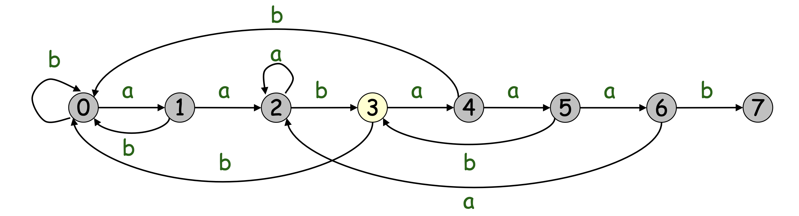

# More String

## The Robin Karp Algorithm

Hashing:
: Changing the string into integer and matching the integer instead.

**How to convert a string P to int p?**
We need the alphabet size m. Sometimes when p is too large, we need to take the mode of it to a very large prime number.

For the pattern text:
$ p = f(P[0,..., m -1]) = (P[m - 1] + d \cdot (P[m-2] +...+d \cdot(P[1] + d \cdot P[0])...))\mod q$

For the text:
$T[0,...,m - 1] = t[0]$
$t[0] = f(T[0,...,m - 1])$
$t[i + 1] = (d \cdot (t[i]- d^{m-1} \cdot T[i]) + T[i + m]) \mod q$

## Finite State Automata

Finite State Automata is defined by:
1. $Q$ : a set of state
2. $p_0 \in Q$ : the start state.
3. $A \subset Q$ : the accepting (finish) state.
4. $\Sigma$ : the input alphabet
5. $\delta$ : a transition function from $Q * \Sigma \rightarrow Q$

e.g.
pattern: aabaaa
$Q = \{0,1,2,3,4,5,6\} $
$\Sigma = \{a,b\}$, $q_0 = 0$, $A = \{6\}$



On state 6 to state 7:
meet b (match): the accept state.
meet a (mismatch): state 2

**FSA build itself**

Time complexity: 
Building the function -> $O(| \Sigma | \cdot m)$
Matching the text -> $O(n)$

Space complexity:
Building the function is also $O(| \Sigma | \cdot m)$ because we need to store the transition table.

```Java
buildFSA(String str){
    int[][] fsaTable = new int[str.length][alphabetSize];
    int x = 0;
    for(int i = 0; i < str.length; i++){
        int character = str.charAt(i) - 'a';
        for(int j = 0; j < alphabetSize; j++){
            if(charcter == j){
                fsaTable[i][j] = i + 1;
            }else{
                fsaTable[i][j] = fsaTable[x][j];
            }
        }
        if(i != 0){
            x = fsaTable[x][character]
        }
    }
}
```

**Using it to solve String matching**

This is faster, because it skips some of the matching between T and P.

1. build FSA of the input pattern P.
2. run FSA on text T. (when meet the accept state $\rightarrow$ found)

The final time complexity and space complexity are all $O( | \Sigma | \cdot m)$

**Pseudocode**

```Java
n = length(T), m = length(P)
transition[][] sigma = transition[m][alphabetSize]
q = 0;
for i = 1 to n
    q = checkSigma(sigma, q, T[i])
        if q = m;
            pattern occur at shift i - m;
        else 
            cannot find
```