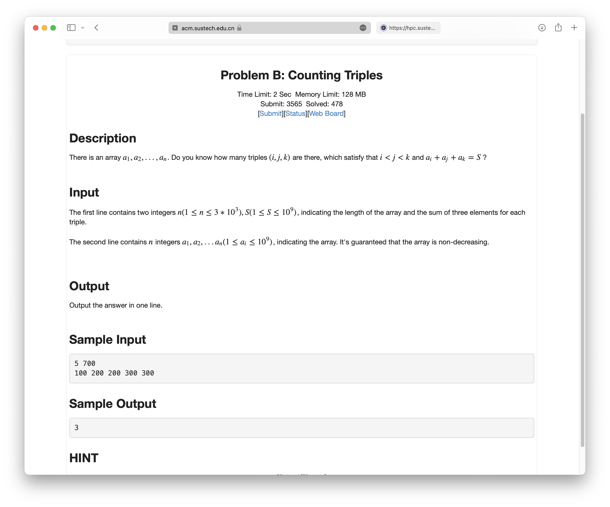

# Comments of Week2 and Week3

### About `long` and `int`

Using `long` and `int` is very important while doing DSAA homework. Although during java homework we normally only care about int, but DSAA homework usually requires long for finishing the homework in the right way.

For example:

I was stuck on this problem for a super long time because of long and int, as we can see the worst case of answer of this problem (or the biggest case) is
$$\begin{pmatrix} 
    3 * 10^3 \\ 
    3 
\end{pmatrix} $$
Which is super large, way larger than $2*10^9$, so using int will always lead to WA. What we can learn from this homework is to calculate the size of our homework solutions in advance and make sure about using int or long.